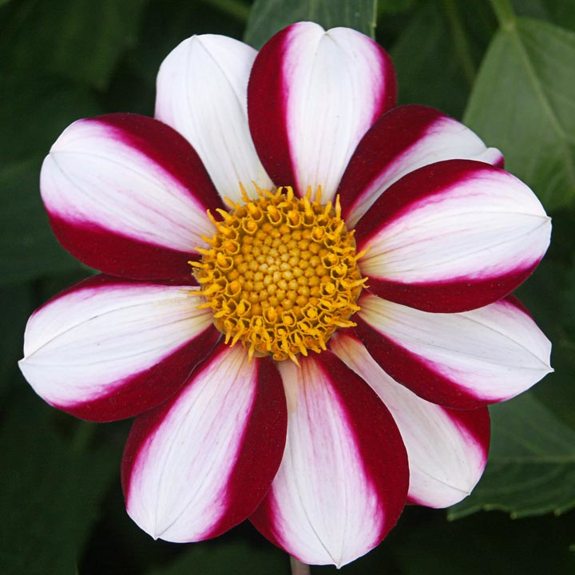
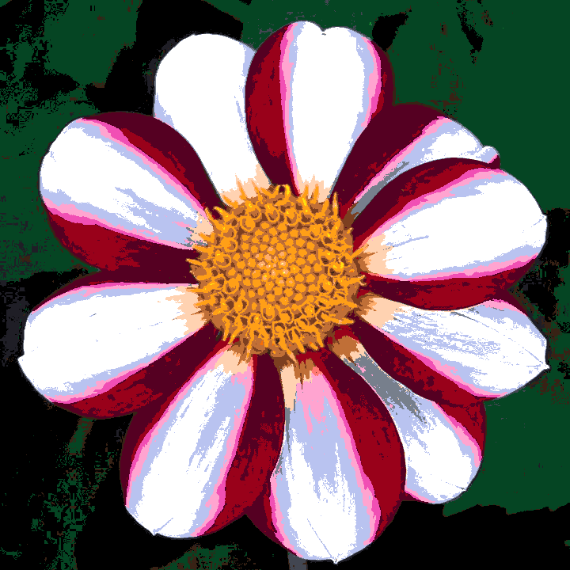
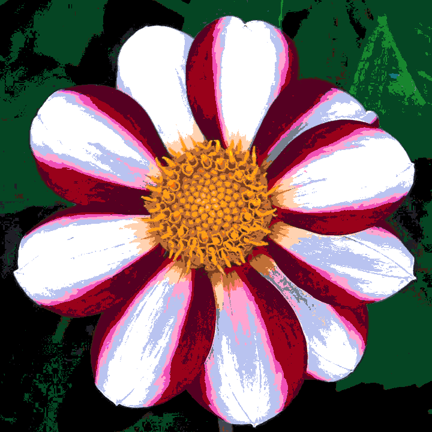
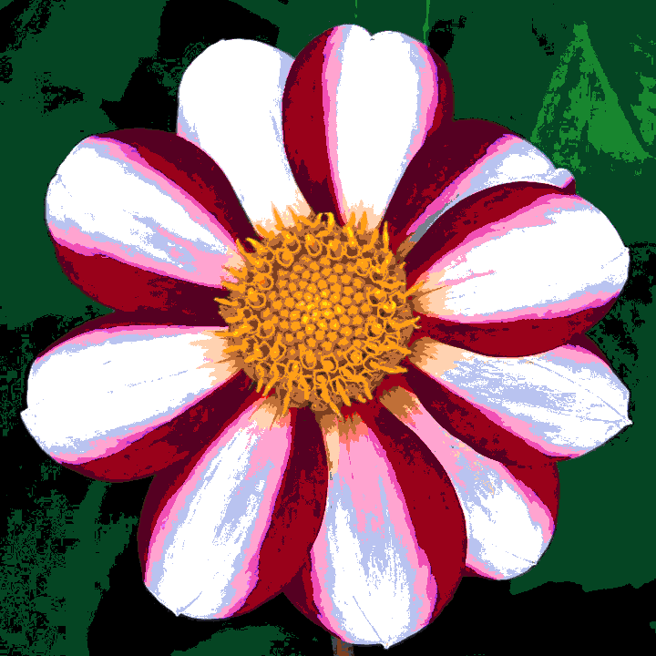
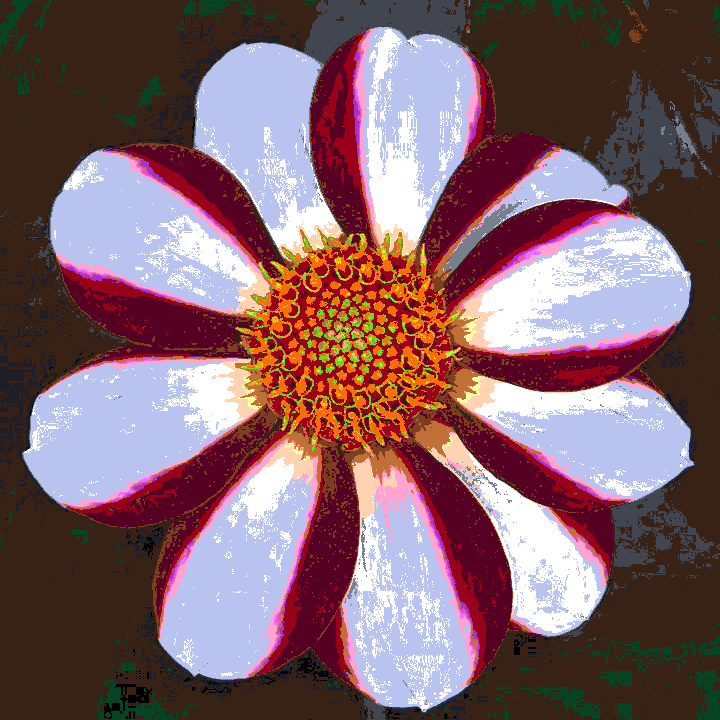
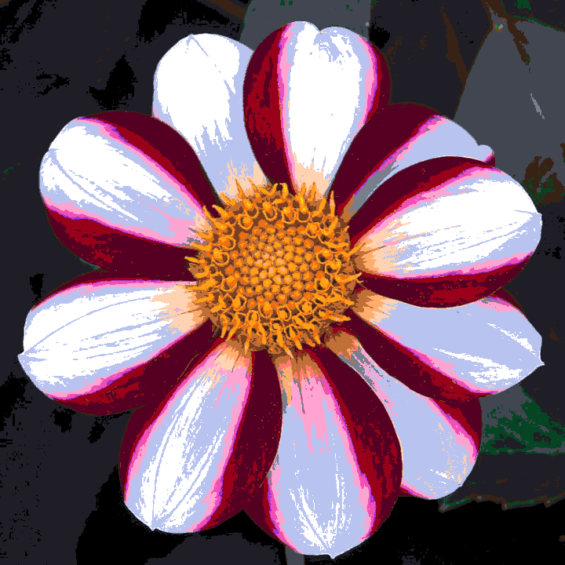
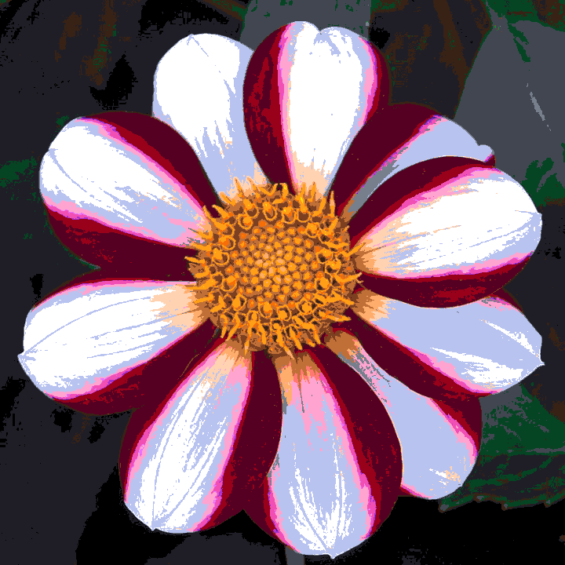
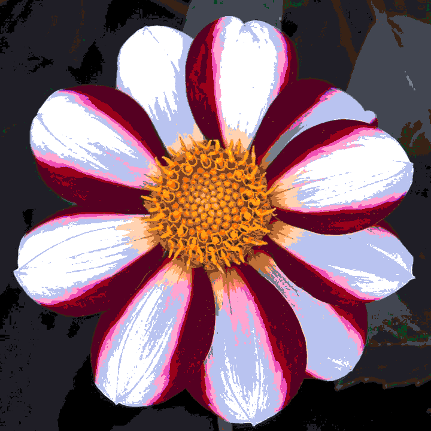

# Quantization

A Python image quantization tool that reduces image colors using a custom palette and configurable color distance strategies.
The project supports multiple color distance algorithms, palette-based quantization, and generation/application of precomputed lookup tables (LUTs) for faster processing.

## Features

- Quantize images using a custom color palette
- Support multiple color distance algorithms:
- Process individual images or complete directories
- Generate full color lookup tables (LUTs)
- Apply existing LUT files for fast quantization
- Efficient image processing using NumPy and OpenCV

## Example

All the examples below use the same [palette](./docs/assets/palettes/canva.png) image and the same [input](./docs/example/input/flower.jpg) image.

<div style="display: flex; justify-content: center; align-items: center; margin-bottom: 20px;">
  
</div>

This palette was retired from the [fediverse canvas](https://canvasstats.com/colors) colors.

<table>
  <thead>
    <tr>
      <th>Strategy</th>
      <th>Image</th>
    </tr>
  </thead>
  <tbody>
    <tr>
      <td>Original</td>
      <td></td>
    </tr>
    <tr>
      <td>CIELAB</td>
      <td></td>
    </tr>
    <tr>
      <td>DELTA_E94</td>
      <td></td>
    </tr>
    <tr>
      <td>DELTA_E2000</td>
      <td></td>
    </tr>
    <tr>
      <td>HSV_DISTANCE</td>
      <td></td>
    </tr>
    <tr>
      <td>MANHATTAN</td>
      <td></td>
    </tr>
    <tr>
      <td>RED_MEAN</td>
      <td></td>
    </tr>
    <tr>
      <td>SQR_EUCLIDEAN</td>
      <td></td>
    </tr>
    <tr>
      <td>WGT_EUCLIDEAN</td>
      <td></td>
    </tr>
  </tbody>
</table>

## Requirements

- Python >= 3.14
- uv package manager

## Installation

Clone the repository:

```bash
git clone https://github.com/Maheshivara/palette-quantization.git
cd palette-quantization
```

Install dependencies using uv:

```bash
uv sync
```

Run the application:

```bash
uv run src/main.py --help
```

## Usage

The tool requires either:

- a palette image (`--palette`)
- an existing lookup table (`--lut`) in 64x64x64 format (png)

### Quantize an image using a palette

```bash
uv run python src/main.py --palette palette.png input.png output.png
```

The input image is reduced to the colors available in the provided palette.

## Color Distance Strategies

By default, all available strategies are used.
To select specific strategies:

```bash
uv run src/main.py --palette palette.png \\
--strategy CIELAB DELTA_E2000 \\
input.png output.png
```

Available strategies:
| Strategy        | Description                             |
|-----------------|-----------------------------------------|
| `SQR_EUCLIDEAN` | Squared RGB Euclidean distance          |
| `WGT_EUCLIDEAN` | Weighted Euclidean color distance       |
| `MANHATTAN`     | Manhattan/L1 color distance             |
| `RED_MEAN`      | Red Mean color distance                 |
| `HSV_DISTANCE`  | Distance calculation in HSV color space |
| `CIELAB`        | CIELAB color distance                   |
| `DELTA_E94`     | CIE Delta E 1994                        |
| `DELTA_E2000`   | CIE Delta E 2000                        |

## Processing Directories

The input path can be either:

- a single image file
- a directory containing images
  Example:

```bash
uv run src/main.py -p palette.png input/ output/
```

When the input path is a directory, the output path must also be a directory.
Example:

```text
images/
├── image1.png
├── image2.png
└── image3.png
output/
├── image1.strategy.png
├── image2.strategy.png
└── image3.strategy.png
```

## Lookup Tables (LUT)

For repeated quantization using the same palette, a full LUT can be generated (and is recommended).
Generate LUT files:

```bash
uv run src/main.py --palette palette.png \\
--create-lut \\
--lut-output-dir lut/ \\
input.png output.png
```

The generated LUT contains precomputed mappings from RGB colors to palette entries.
Once created, a LUT can be reused:

```bash
uv run src/main.py --lut lut/example.lut \\
input.png output.png
```

Using LUT files avoids recalculating color distances and significantly improves performance for repeated processing.

## Command Line Reference

```text
usage:
uv run src/main.py [options] INPUT OUTPUT 

positional arguments:
INPUT                   Input image file or directory
OUTPUT                  Output image file or directory

options:
-s, --strategy          Color distance strategies to use
-p, --palette           Palette image used for quantization
-l, --lut               Existing LUT file (or dir with multiple LUTs) to apply
-c, --create-lut        Generate full LUT(s) from the palette
--lut-output-dir        Directory where generated LUT files are saved
```

## Color Distance Notes

Different strategies provide different trade-offs between speed and perceptual accuracy.

### Fast methods

- `SQR_EUCLIDEAN`
- `WGT_EUCLIDEAN` (Same as `SQR_EUCLIDEAN` but with a different weighting)
- `MANHATTAN`

### More perceptually accurate methods

- `CIELAB`
- `DELTA_E94`
- `DELTA_E2000` (In the theory the most accurate, but slower (but my experience begs to differ))

### Alternative color-space approaches

- `HSV_DISTANCE`
- `RED_MEAN`

The best strategy depends on:
- the palette being used
- the image content
- the desired balance between speed and quality, but if you make a LUT, the speed is not a problem anymore, so you can use the most accurate method.
